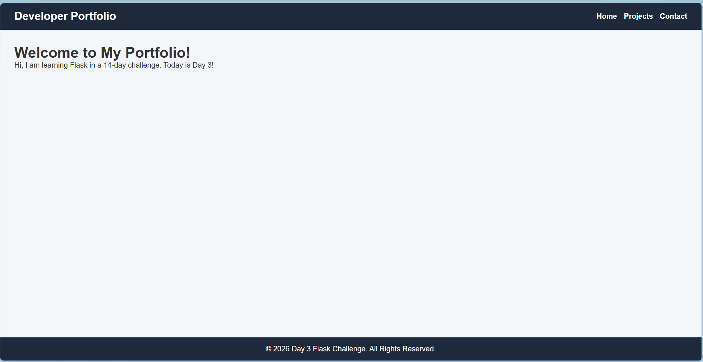
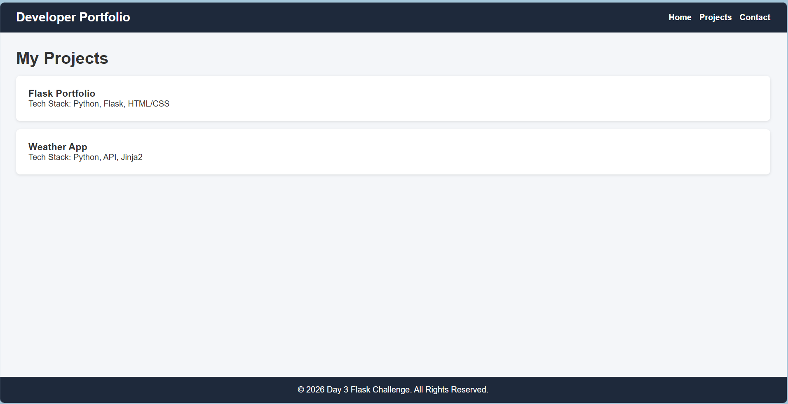
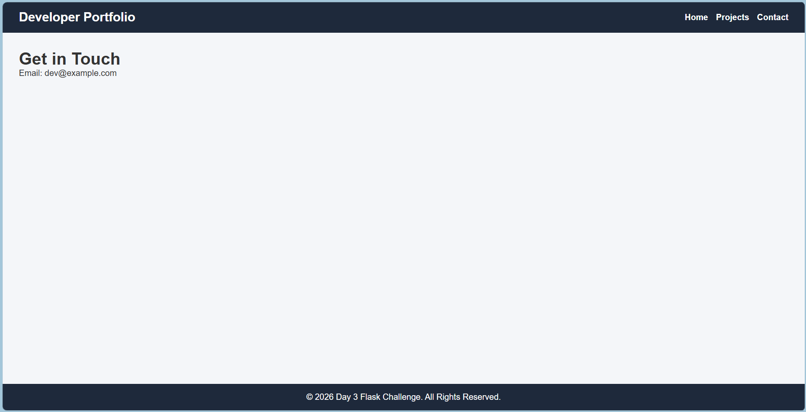

# 🚀 Day 3 - Multi-Page Portfolio

A beginner-friendly Flask project that demonstrates **Routing, Template Inheritance, Static Files, Dynamic Data Passing, and Jinja2**.

This project is part of my **14 Days of Flask Challenge**, where I learn Flask by building practical projects every day.

---

# 📸 Preview

> Add your screenshots here

```md





```

---

# 📚 What You'll Learn

By studying this project, you'll understand:

- Flask Routing
- Dynamic URLs
- Jinja2 Template Engine
- Template Inheritance
- Static Files
- Passing Python Data to HTML
- Reusable Layouts
- Project Structure

---

# 🛠 Tech Stack

- Python
- Flask
- HTML5
- CSS3
- Jinja2

---

# 📁 Project Structure

```
Day-3-Flask-Portfolio/
│
├── app.py
│
├── templates/
│   ├── base.html
│   ├── home.html
│   ├── projects.html
│   └── contact.html
│
├── static/
│   └── css/
│       └── style.css
│
├── assets/
│
├── README.md
└── .gitignore
```

---

# ⚙ Installation

Clone the repository

```bash
git clone <repository-url>
```

Move into the folder

```bash
cd Day-3-Flask-Portfolio
```

Create Virtual Environment

```bash
python -m venv venv
```

Activate Virtual Environment

Windows

```bash
venv\Scripts\activate
```

Linux / macOS

```bash
source venv/bin/activate
```

Install Flask

```bash
pip install flask
```

Run the application

```bash
python app.py
```

Open

```
http://127.0.0.1:5000/
```

---

# 📂 Flask Routing

Inside **app.py**

```python
@app.route('/')
def home():
    return render_template('home.html')
```

When the browser visits

```
/
```

Flask executes the **home()** function and renders

```
home.html
```

Similarly,

```
/projects
```

renders

```
projects.html
```

and

```
/contact
```

renders

```
contact.html
```

---

# 📦 Passing Data from Flask to HTML

Python

```python
project_list = [
    {"title":"Flask Portfolio","tech":"Python, Flask"},
    {"title":"Weather App","tech":"API, Flask"}
]

return render_template(
    "projects.html",
    projects=project_list
)
```

The variable **projects** becomes available inside the HTML template.

---

# 🔁 Jinja2 Template Inheritance

Instead of writing the same HTML repeatedly, Flask uses a **base template**.

```
base.html
```

contains

- Navbar
- Footer
- CSS Links

Every page extends it.

```html

```

The content is inserted into

```html



```

This keeps the code clean and reusable.

---

# 🔄 Jinja2 Loop

Projects are displayed dynamically using a loop.

```html

```

Access values

```html
{{ p.title }}

{{ p.tech }}
```

The loop automatically creates a card for every project.

---

# 🎨 Static Files

CSS is stored inside

```
static/css/style.css
```

and linked using

```html
{{ url_for('static', filename='css/style.css') }}
```

This is the recommended Flask way to load static files.

---

# 🌐 Available Routes

| Route | Description |
|---------|-------------|
| `/` | Home Page |
| `/projects` | Displays Portfolio Projects |
| `/contact` | Contact Page |

---

# 🎯 Concepts Covered

✅ Flask Application

✅ Flask Routing

✅ render_template()

✅ url_for()

✅ Static Files

✅ Jinja2

✅ Template Inheritance

✅ Template Blocks

✅ Jinja2 Loops

✅ Passing Python Objects to HTML

---

# 📖 Learning Outcome

After completing this project, you'll understand:

- How Flask serves web pages
- How templates work
- How HTML and Python communicate
- Why Jinja2 is powerful
- How reusable layouts reduce duplicate code
- How to organize Flask projects professionally

---

# 👨‍💻 Author

**Noor Hasan**

GitHub:
https://github.com/noorhasann

---

# ⭐ Support

If you found this project helpful, don't forget to ⭐ the repository.

Happy Coding! 🚀