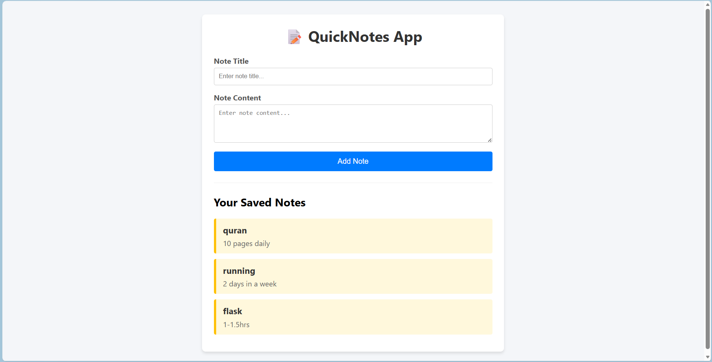

# 📝 Day 04 - QuickNotes App

A simple Flask application where users can create and view notes using HTML forms. Notes are stored in an in-memory Python list, so they remain available only while the server is running.

---

# 📸 Preview



---

## 🚀 Features

- Add notes using an HTML form
- Store notes in an in-memory Python list
- Display all saved notes dynamically
- Form handling with `POST`
- Redirect after form submission using `redirect()` and `url_for()`

## 📚 Concepts Covered

- Flask Routing
- HTTP Methods (`GET` & `POST`)
- `request.form`
- `redirect()`
- `url_for()`
- Jinja2 Template Rendering
- In-Memory Data Storage

## 📂 Project Structure

```
Day-04-QuickNotes-App/
│── app.py
│── templates/
│   └── index.html
│── README.md
│── .gitignore
```

## ▶️ Run the Project

1. Clone the repository

```bash
git clone <your-repo-url>
```

2. Create a virtual environment

```bash
python -m venv venv
```

3. Activate it

**Windows**

```bash
venv\Scripts\activate
```

**macOS/Linux**

```bash
source venv/bin/activate
```

4. Install Flask

```bash
pip install flask
```

5. Start the application

```bash
python app.py
```

6. Open your browser

```
http://127.0.0.1:5000/
```

## ⚠️ Note

This project uses **in-memory storage**, so all notes are lost whenever the Flask server is restarted.

---

# 👨‍💻 Author

**Noor Hasan**

GitHub: https://github.com/noorhasann
Learning in public, one project at a time.
