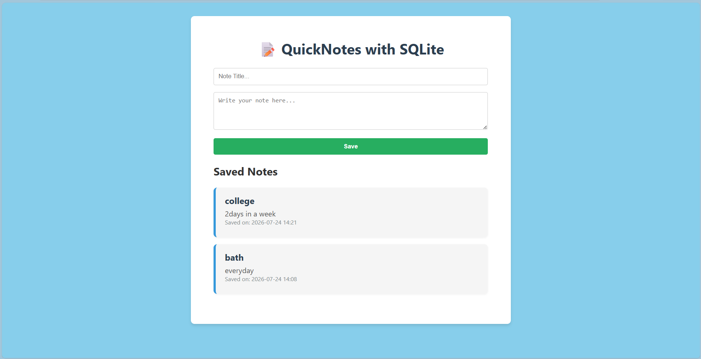

# 📝 Day 05 - QuickNotes App with SQLite

A simple **Flask + SQLite** application where users can create and save notes permanently using a database.

Unlike the previous version that stored notes in memory (which disappeared after restarting the server), this version stores notes inside a **SQLite database**, so your notes remain available even after restarting the application.

---

## 🚀 Features

- 💾 Store notes permanently using SQLite
- 📅 Automatically save creation date & time
- 🔄 Newest notes appear first
- 🎨 Clean and responsive UI
- ⚡ Built with Flask & SQLAlchemy ORM

---

# 📸 Preview




---

## 📁 Project Structure

```
Day-05-Persistent-QuickNotes/
│
├── app.py
├── requirements.txt
├── README.md
│
├── instance/
│   └── quicknotes.db
│
├── templates/
│   └── index.html
│
└── assets/
    └── ss.png
```

---

# 🛠️ Technologies Used

- Python 3
- Flask
- Flask-SQLAlchemy
- SQLite
- HTML5
- CSS3

---

# 📦 Installation

## 1. Clone Repository

```bash
git clone https://github.com/noorhasann/14-Days-of-Flask-Challenge.git
```

---

## 2. Move into Project Folder

```bash
cd 14-Days-of-Flask-Challenge
```

---

## 3. Create Virtual Environment

Windows

```bash
python -m venv venv
```

Activate

```bash
venv\Scripts\activate
```

Linux / Mac

```bash
python3 -m venv venv
source venv/bin/activate
```

---

## 4. Install Dependencies

```bash
pip install -r requirements.txt
```

or

```bash
pip install Flask Flask-SQLAlchemy
```

---

## 5. Run the Application

```bash
python app.py
```

Server starts at

```
http://127.0.0.1:5000
```

---

# 🗄️ Database

This project uses **SQLite** with **Flask-SQLAlchemy**.

Database URI

```python
sqlite:///quicknotes.db
```

When the application starts for the first time:

```python
db.create_all()
```

automatically creates the required database tables.

---

# 📚 Concepts Covered

This project helps beginners understand:

- Flask Routing
- GET Request
- POST Request
- HTML Forms
- request.form
- Redirect after POST
- url_for()
- SQLAlchemy ORM
- Database Models
- SQLite Database
- CRUD (Create & Read)
- Database Session
- Commit Transactions
- Querying Records
- Ordering Database Records
- Jinja2 Template Rendering

---

# 🧠 SQLAlchemy Model

```python
class Note(db.Model):
    id = db.Column(db.Integer, primary_key=True)
    title = db.Column(db.String(100), nullable=False)
    content = db.Column(db.Text, nullable=False)
    date_created = db.Column(db.DateTime)
```

This model creates a table named **Note** containing:

| Column | Type | Description |
|---------|------|-------------|
| id | Integer | Primary Key |
| title | String | Note Title |
| content | Text | Note Body |
| date_created | DateTime | Timestamp |

---

# 🔄 Application Flow

```
User Opens Website
        │
        ▼
Flask renders index.html
        │
        ▼
User fills Note Form
        │
        ▼
POST Request
        │
        ▼
request.form
        │
        ▼
Create Note Object
        │
        ▼
db.session.add()
        │
        ▼
db.session.commit()
        │
        ▼
SQLite Database
        │
        ▼
Redirect
        │
        ▼
Fetch All Notes
        │
        ▼
Display on Website
```

---

# 📖 What I Learned

During this project I learned:

- How databases differ from in-memory storage.
- How Flask communicates with SQLite.
- How SQLAlchemy ORM maps Python classes to database tables.
- How to insert data into a database.
- How to retrieve records from a database.
- How to display dynamic data using Jinja2.
- Why redirecting after POST is considered a good practice.

---

# 🌟 Future Improvements

- ✏️ Edit Notes
- 🗑️ Delete Notes
- 🔍 Search Notes
- 📌 Pin Important Notes
- 🌙 Dark Mode
- 📱 Better Responsive Design
- 🔐 User Authentication

---

# 👨‍💻 Author

**Noor Hasan**

GitHub:
https://github.com/noorhasann

---

## ⭐ Support

If you found this project helpful, consider giving it a ⭐ on GitHub.

It motivates me to continue building and sharing more Flask projects.

---

> Day 05 of my **14 Days of Flask Challenge** 🚀