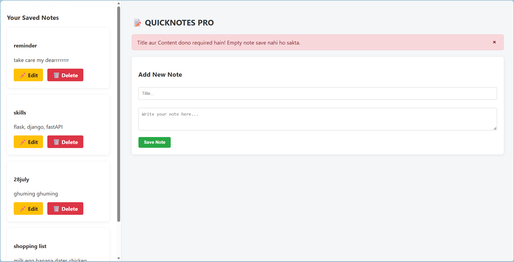

# 📝 Day 07 - QuickNotes Pro (Validation & Error Pages)

Today's focus was making the QuickNotes application production-ready by implementing server-side input validation, real-time user feedback via Flash messaging, and custom HTTP error handling.

---

## 📸 Project Preview



---

## 🎯 Learning Objectives & Core Concepts

- **Backend Input Validation:** Preventing empty or whitespace-only submissions using Python string sanitation (`.strip()`).
- **User Alert System:** Utilizing Flask's built-in `flash()` and `get_flashed_messages()` to trigger dynamic UI alerts/toasts.
- **Custom Error Handling:** Catching HTTP `404` errors using the `@app.errorhandler(404)` decorator and rendering a friendly fallback template.

---

## 🛠️ Key Features Built Today

1. **Empty Note Prevention:** Checks incoming POST data before making database operations.
2. **Flash Alert Feedback:**
   - 🔴 **Red Alert (Danger):** Triggers when a user submits blank/empty fields.
   - 🟢 **Green Alert (Success):** Triggers when a note is successfully saved.
3. **Styled 404 Error Page:** Redirects invalid routes to a custom-designed `404.html` page with a button back to home.

---

## 📂 Project Structure

day-07-quicknotes-pro/
├── assets/
│   └── ss.png
├── app.py                 # Main Flask Application & Error Handlers
├── instance/
│   └── notes.db           # SQLite Database
├── templates/
│   ├── index.html         # Main Workspace & Notes List (with Flash Messages)
│   └── 404.html           # Custom 404 Page Not Found Template
└── README.md              # Project Documentation

---

## ⚙️ Installation

1. Clone the repository

```bash
git clone https://github.com/noorhasann/14-Days-of-Flask-Challenge.git
```

2. Navigate to the project folder

```bash
cd 14-Days-of-Flask-Challenge/Day-07-quicknotes-pro
```

3. Create a virtual environment

```bash
python -m venv venv
```

4. Activate the virtual environment

**Windows**

```bash
venv\Scripts\activate
```

**macOS/Linux**

```bash
source venv/bin/activate
```

5. Install dependencies

```bash
pip install -r requirements.txt
```

6. Run the application

```bash
python app.py
```

7. Open your browser

```
http://127.0.0.1:5000/
```
---

# 👨‍💻 Author

**Noor Hasan**

GitHub: https://github.com/noorhasann

Building projects while learning Flask, one day at a time.