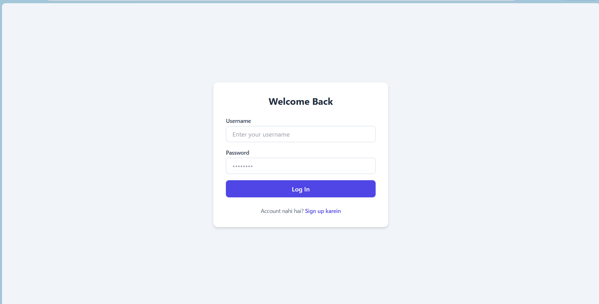
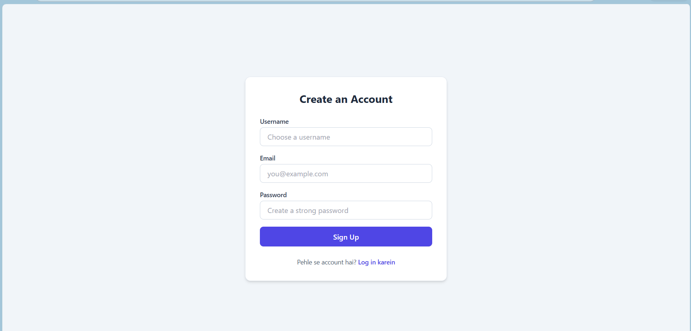
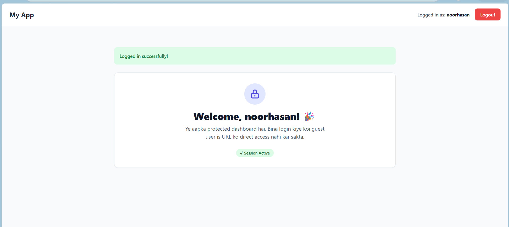

# Day 09 - Flask User Authentication & Protected Sessions 🔐

A secure user authentication system built with Flask. This project demonstrates user registration, login/logout functionality, password hashing, session management, and protected routes using Flask-Login.

---

## 📸 Screenshots

### Login Page


### Signup Page


### Dashboard


---

## 📌 Features

- User Registration
- User Login
- Secure Password Hashing
- User Logout
- Protected Dashboard
- Session Management
- Flash Messages
- SQLite Database
- Responsive UI with Tailwind CSS

---

## 🛠️ Tech Stack

- Python
- Flask
- Flask-SQLAlchemy
- Flask-Login
- Werkzeug Security
- SQLite
- Tailwind CSS

---

## 📂 Project Structure

```
day-09-blog-engine-login&logout-sessionshield/
│
├── app.py
├── models.py
├── instances/
│   ├── blog.db
├── requirements.txt
├── .gitignore
│
├── templates/
│   ├── login.html
│   ├── signup.html
│   └── dashboard.html
│
└── README.md
```

---

## 🚀 Installation

### 1. Clone Repository

```bash
git clone https://github.com/noorhasann/14-Days-of-Flask-Challenge.git
```

### 2. Go to Project

```bash
cd day-09-authentication
```

### 3. Create Virtual Environment

```bash
python -m venv venv
```

### 4. Activate Virtual Environment

Windows

```bash
venv\Scripts\activate
```

Linux / macOS

```bash
source venv/bin/activate
```

### 5. Install Dependencies

```bash
pip install -r requirements.txt
```

### 6. Run the Project

```bash
python app.py
```

Open

```
http://127.0.0.1:5000
```

---

## 📸 Features Demonstrated

- Signup with unique username & email
- Password hashing using Werkzeug
- Secure Login
- Flask-Login session management
- Protected Dashboard (`@login_required`)
- Logout functionality
- Flash messages for user feedback

---

## 📚 Concepts Learned

- Flask Authentication
- Flask-Login
- User Sessions
- Password Hashing
- SQLAlchemy ORM
- SQLite Database
- Protected Routes
- Flash Messages
- Jinja2 Templates

---

## 🔒 Security Features

- Passwords are never stored as plain text.
- Passwords are hashed using Werkzeug.
- Protected routes require authentication.
- User sessions are securely managed by Flask-Login.

---

## 🎯 Learning Outcome

By completing this project, I learned how to implement a complete authentication system in Flask using secure password hashing, user sessions, protected routes, and database integration.

---

## 👨‍💻 Author

**Noor Hasan**

GitHub:
https://github.com/noorhasann