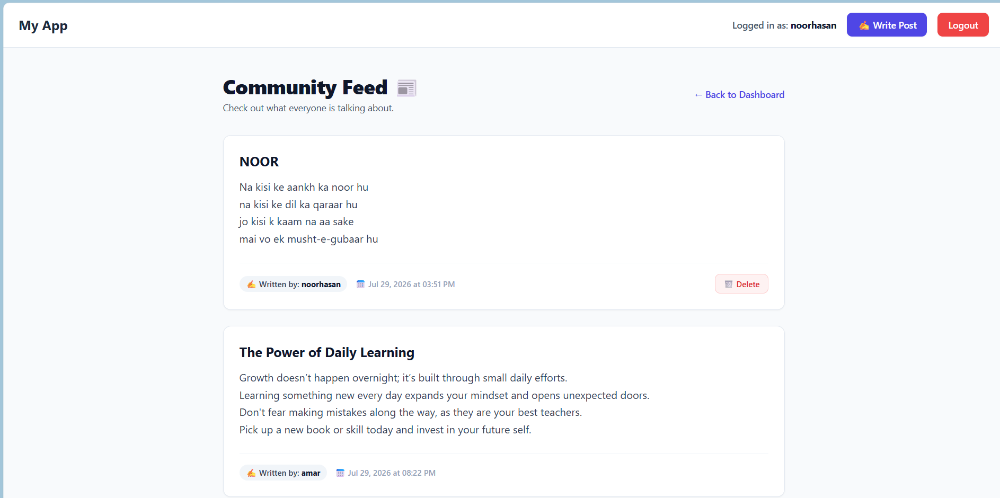
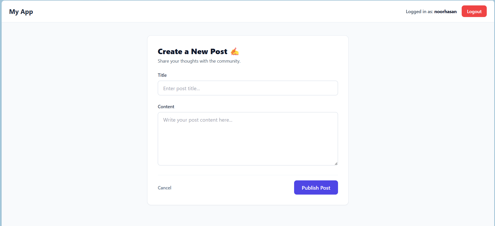

# 📘 Day 10 – Blog Engine: Relational Database (Users + Posts)

A Flask application demonstrating **1-to-Many database relationships** using **SQLAlchemy**. Each registered user can create multiple blog posts, and every post is linked to its author using a **Foreign Key**.

---

## 📸 Screenshots

### 📰 Feed Page



---

### ✍️ Create Post Page



---

## 🧠 Core Concepts Covered

* 1-to-Many Relational Database Modeling
* SQLAlchemy Relationships
* Foreign Keys (`db.ForeignKey`)
* `db.relationship()` for Model Association
* Data Association Between Users & Posts
* ORM Relationship Navigation
* Author-Post Linking
* Flask Authentication Integration
* Database Normalization Basics

---

## 🚀 Features

* 👤 User Registration & Login
* 🔐 Secure Password Hashing
* 📝 Create Blog Posts
* 🔗 One-to-Many Relationship (User → Blog Posts)
* 👨‍💻 Author name displayed below every blog post
* 💾 SQLite Database with SQLAlchemy ORM
* 🎨 Clean HTML Templates using Jinja2

---

## 🛠️ Tech Stack

* Python 3
* Flask
* Flask-SQLAlchemy
* Flask-Login
* Werkzeug Security
* SQLite
* HTML5
* Jinja2

---

## 📂 Project Structure

```text
day-10-blog-engine-relational-db/
│
├── app.py
├── models.py
├── requirements.txt
├── .gitignore
├── instance/
│   └── blog.db
├── templates/
│   ├── index.html
│   ├── login.html
│   ├── signup.html
│   ├── create_post.html
│   └── ...
└── static/
    ├── css/
    └── images/
```

---

## 🗄️ Database Relationship

```text
User
----
id
username
email
password_hash
        │
        │ 1
        │
        ▼
BlogPost
---------
id
title
content
user_id (Foreign Key)
```

One **User** can create **multiple Blog Posts**, while each **Blog Post** belongs to exactly **one User**.

---

## 📌 What I Learned

* How relational databases work
* Creating Foreign Keys in SQLAlchemy
* Using `db.relationship()` to connect models
* Linking blog posts to logged-in users
* Displaying author information dynamically
* Managing one-to-many relationships in Flask

---

## ▶️ Installation

```bash
git clone https://github.com/noorhasann/14-Days-of-Flask-Challenge.git

cd day-10-blog-engine-relational-db

python -m venv .venv

# Windows
.venv\Scripts\activate

# macOS/Linux
source .venv/bin/activate

pip install -r requirements.txt

python app.py
```

---

## 📚 Concepts Practised

* Flask Authentication
* SQLAlchemy ORM
* Database Relationships
* Foreign Keys
* One-to-Many Mapping
* CRUD Operations
* Template Rendering
* User Session Management

---

## 👨‍💻 Author

**Noor Hasan**

GitHub: https://github.com/noorhasann
